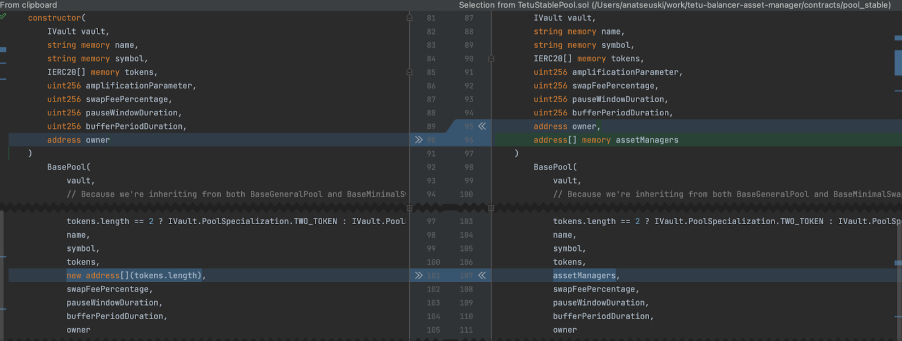
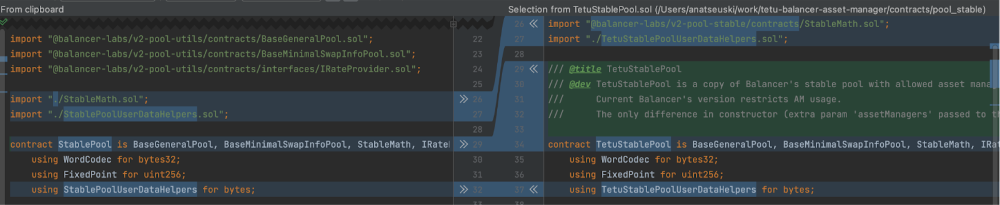
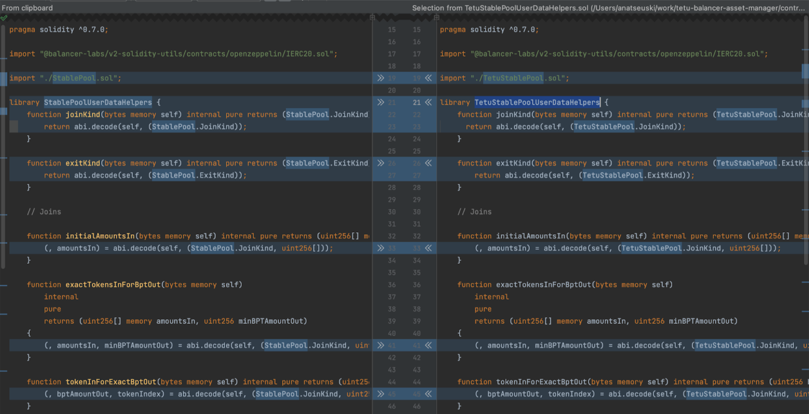
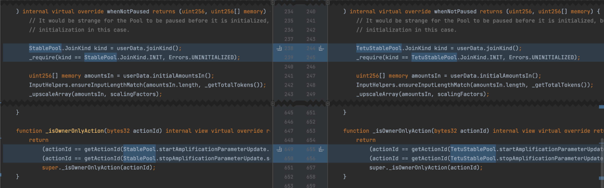

## What is the difference TetuStablePool vs StablePool
###Note:
As a base for the [TetuStablePool](../contracts/pool_stable/TetuStablePool.sol) the "@balancer-labs/v2-pool-stable": "^2.0.0" was used. (latest published version at npm)

Current [Balancer's stable](../node_modules/@balancer-labs/v2-pool-stable/contracts/StablePool.sol) pool didn't allow using asset managers. We updated the implementation to support asset managers.

###What are the changes:
On the left - Balancer's [version]((../node_modules/@balancer-labs/v2-pool-stable/contracts/StablePool.sol)) On the right Tetu [version](../contracts/pool_stable/TetuStablePool.sol)
Exact changes:
1.

Add extra param to constructor and pass it to the Base pool

2.

- Updated import to reflect repo structure.
- Added comments.
- StablePoolUserDataHelpers renamed to TetuStablePoolUserDataHelpers to limit the amount of changes.

TetuStablePoolUserDataHelpers changes:

No changes to the logic, only references to TetuStablePool instead of StablePool
3.

Update code to use TetuStablePool methods.
